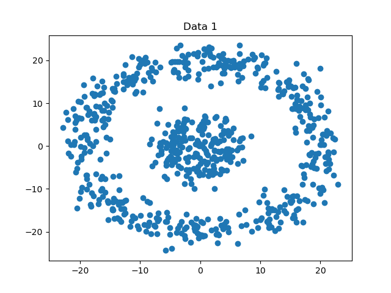
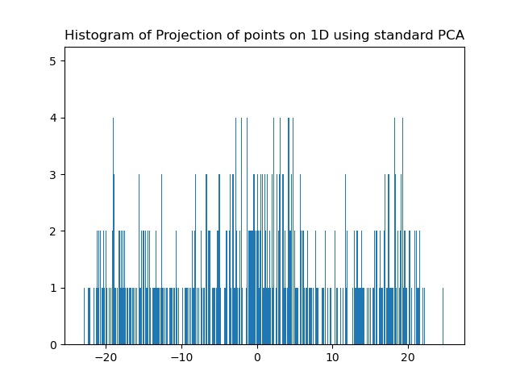
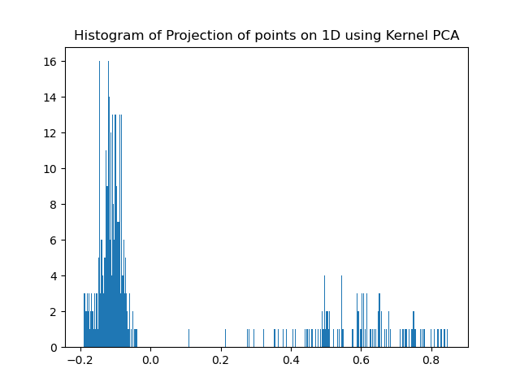
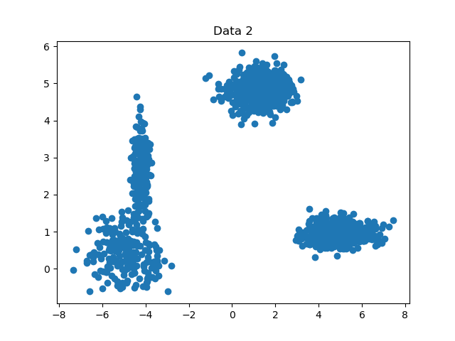

# Kernel PCA

## About
This project is implemented on a toy dataset for Principal Component Analysis (PCA) and Kernel Principal Component Analysis (kPCA)

## Instructions to run the code:
1. Clone the repository using 
```
git clone https://github.com/Abhishek-Nalawade/Kernel-PCA
```
2. Run the code Execute_PCA.py

## Results:
### Dataset: hw06-data1.mat
It can be seen that using Kernel PCA the trends in the data can be captured that cannot be captured using standard PCA.
\
\
 \
\
Plotting the histogram of the data using PCA we get
\
\

\
\
Further plotting the histogram of the data using kPCA we can clearly see the two trends in the data. 
\
\


### Dataset: hw06-data2.mat
We see similar results for the second dataset
\
\
 
